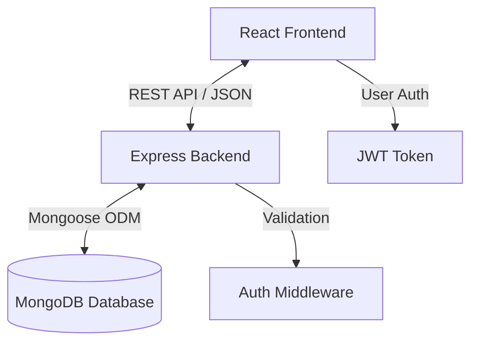

# System Architecture

This document provides a detailed technical overview of the Healthcare Portal's architecture, data flow, and system design.

## 🏗 High-Level Overview

The system is built as a **Monorepo** containing both the Frontend (Client) and Backend (Server) applications. It generally follows a **Client-Server** architecture.

---

## 📂 Project Structure

### Backend (`/backend`)
Follows the **MVC (Model-View-Controller)** pattern, though "Views" are handled by the React frontend via JSON responses.

*   **`server.js`**: Entry point. Incorporates middleware (CORS, Express JSON) and route definitions.
*   **`/models`**: Mongoose schemas defining data structure and validation.
    *   `User.js`: Base user capabilities (Auth, Role).
    *   `ProviderProfile.js`: specific fields for Doctors/Providers.
    *   `PatientProfile.js`: specific fields for Patients (History, Goals).
    *   `Reminder.js`: Daily tasks/reminders for patients.
*   **`/controllers`**: Business logic layer. Separated by domain (`auth`, `admin`, `patient`, `provider`).
*   **`/routes`**: API Endpoint definitions mapping URL paths to controllers.
*   **`/middleware`**: Cross-cutting concerns like Authentication (`auth.js`) for verifying JWTs and Role checking.

### Frontend (`/client`)
A **Single Page Application (SPA)** built with Vite + React.

*   **`/src/pages`**: Top-level views (e.g., `AdminDashboard`, `PatientDashboard`).
*   **`/src/components`**: Reusable UI blocks (`Navbar`, `ProviderList`).
*   **`/src/context`**: React Context API for global state management (specifically `AuthContext` for user session).
*   **`/src/services`**: Axios instances for API communication.
*   **`/src/routes`**: Frontend routing configuration (React Router).

---

## 🔐 Security & Authentication Flow

1.  **Registration/Login**: User sends credentials to `/api/auth/login`.
2.  **Token Generation**: Server validates credentials and signs a **JWT (JSON Web Token)** containing the `userId` and `role`.
3.  **Client Storage**: The frontend stores this JWT (typically in `localStorage`).
4.  **Authenticated Requests**:
    *   Client attaches the token to the `Authorization` header (`Bearer <token>`) for every subsequent request.
    *   **Middleware** (`protect`): Decodes the token, verifies validity, and attaches `req.user` to the request object.
    *   **RBAC** (`authorize`): Checks if `req.user.role` matches the required role for the specific route.

---

## 💾 Data Models & Relationships

### Users
*   **Role**: (`admin` | `patient` | `provider`)
*   **Authentication**: Email/Password (Hashed).

### Patient - Provider Relationship
*   A **Patient** can be assigned to **one Provider**.
*   A **Provider** can have **multiple Patients**.
*   This is a **1:N** relationship modeled via a reference in the `PatientProfile`.

### Reminders
*   Linked to a specific **Patient** and created by a **Provider**.
*   Daily status tracking (completed boolean).

---

## 🔄 Data Flow Example: "Assigning a Provider"

1.  **User Action**: Patient clicks "Select Provider" on their dashboard.
2.  **API Call**: `POST /api/patient/provider/:providerId` (Authorized as Patient).
3.  **Backend Logic**:
    *   `protect` middleware verifies user identity.
    *   `patientController` finds the Patient's profile.
    *   Updates the `assignedProvider` field with the new ID.
    *   Adds the Patient ID to the Provider's `assignedPatients` list.
4.  **Response**: Returns updated Patient profile.
5.  **UI Update**: React re-renders to show the new Provider's details.

